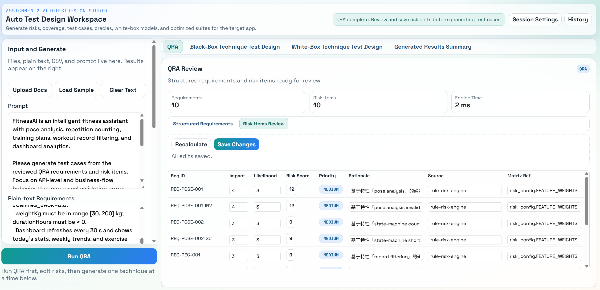
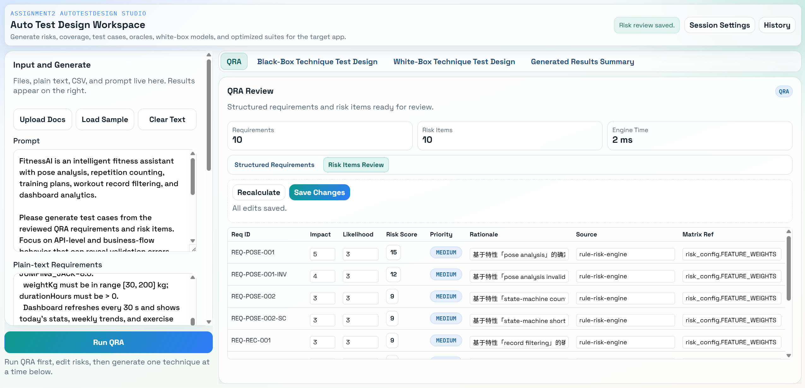
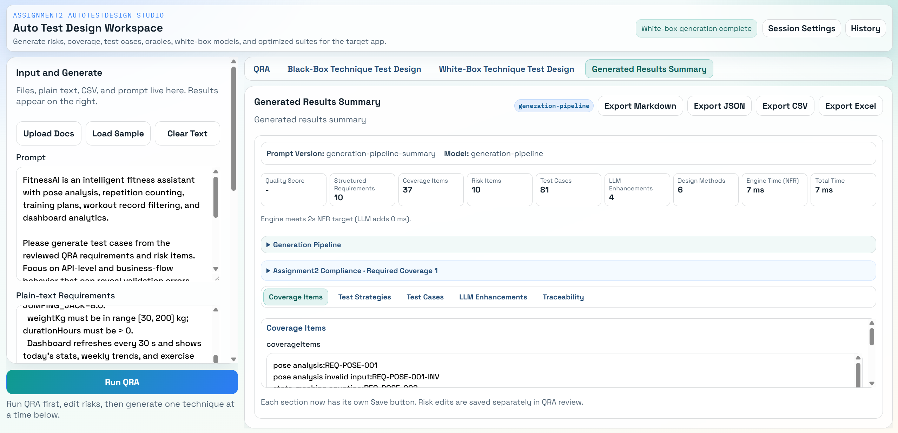

# FitnessAI 风险分析报告

> **文档类型**：风险分析报告（Risk Analysis Report）  
> **目标应用**：FitnessAI — 基于 AI 的智能健身辅助系统  
> **报告版本**：v2.0  
> **生成方式**：**AutoTestDesign 工具 QRA 引擎生成（规则引擎 v2，离线模式）+ 人工审查补充**  
> **工具版本**：`autotestdesign-engine-v2`，Prompt 版本 `generation-pipeline-summary`  
> **日期**：2026-05-25  

---

## 1. 概述

### 1.1 目标应用简介

FitnessAI 是一个基于计算机视觉和 AI 的智能健身辅助系统，采用前后端分离架构：

| 组件 | 技术栈 | 职责 |
|------|--------|------|
| 后端 | Spring Boot 3.2 / Java 17 | REST API、姿态分析引擎、数据持久化 |
| 前端 | React + TypeScript | 摄像头采集、MediaPipe 姿态检测、UI 展示 |
| 数据库 | PostgreSQL (Neon 云) | 用户数据、运动记录、每日统计 |
| 容器化 | Docker Compose | 服务编排与部署 |

### 1.2 工具生成流程说明

本报告的风险矩阵由 **AutoTestDesign 工具的 QRA（Qualitative Risk Analysis）引擎**自动生成，流程如下：

```
① 将 FitnessAI CSV 格式需求输入工具
        ↓
② 工具 QRA 引擎解析需求，提取特征权重
   （risk_engine: riskScore = impact × likelihood）
        ↓
③ 生成 10 条结构化风险项（2ms 内完成）
        ↓
④ 人工交互审查：将 REQ-POSE-001 的 Impact 由 4 调整为 5
   → Recalculate → Risk Score 12 → 15
   → Save Changes（截图见附录 A）
        ↓
⑤ 导出 Excel + JSON 作为原始证据
```

### 1.3 风险评估方法

采用 **ISO/IEC/IEEE 29119-1** 基于风险的测试方法，工具使用的风险评分公式：

$$\text{Risk Score} = \text{Impact} \times \text{Likelihood}$$

| 优先级 | 风险分值 | 说明 |
|--------|---------|------|
| HIGH | ≥ 16 | 需立即处理 |
| MEDIUM | 6–15 | 计划内处理 |
| LOW | 1–5 | 监控处理 |

---

## 2. AutoTestDesign 工具生成的风险矩阵（QRA 阶段输出）

> **数据来源**：AutoTestDesign 工具 QRA 引擎自动生成，经人工交互审查后保存。  
> **Engine Time**：2 ms（截图见附录 A）

| Req ID | 特性描述 | Impact | Likelihood | Risk Score | Priority | 生成来源 |
|--------|---------|--------|-----------|-----------|----------|---------|
| **REQ-POSE-001** | pose analysis — 姿态分析正常输入处理 | **5** *(审查修改：原 4)* | 3 | **15** | MEDIUM | rule-risk-engine |
| REQ-POSE-001-INV | pose analysis invalid input — 非法输入处理 | 4 | 3 | 12 | MEDIUM | rule-risk-engine |
| REQ-POSE-002 | state-machine counting — 状态机计数完整循环 | 3 | 3 | 9 | MEDIUM | rule-risk-engine |
| REQ-POSE-002-SC | state-machine short cycle — 非法短循环不计数 | 3 | 3 | 9 | MEDIUM | rule-risk-engine |
| REQ-REC-001 | record filtering — 无效记录过滤（count<3 AND duration<30）| 3 | 3 | 9 | MEDIUM | rule-risk-engine |
| REQ-REC-001-SAVE | record saving — 有效记录保存入库 | 3 | 3 | 9 | MEDIUM | rule-risk-engine |
| REQ-PLAN-001 | training plan easy — 简单训练计划生成 | 3 | 3 | 9 | MEDIUM | rule-risk-engine |
| REQ-PLAN-001-MED | training plan medium — 中等训练计划生成 | 3 | 3 | 9 | MEDIUM | rule-risk-engine |
| REQ-PLAN-001-HARD | training plan hard — 困难训练计划生成 | 3 | 3 | 9 | MEDIUM | rule-risk-engine |
| REQ-DASH-001 | dashboard calories — 仪表板卡路里计算（MET×体重×时长）| 3 | 3 | 9 | MEDIUM | rule-risk-engine |

**工具交互审查记录**：
- 审查员发现 REQ-POSE-001（姿态分析核心路径）是系统最高频调用接口，自动评分偏低
- 将 Impact 由 4 → **5**，Recalculate 后 Risk Score 由 12 → **15**
- 点击 Save Changes，系统提示 "Risk review saved"（截图见附录 A-1）

---

## 3. 审查员补充风险分析

> 工具 QRA 基于需求文本的特征权重评分，以下为审查员结合源代码（`UserService.java`、`SquatAnalyzer.java` 等）进行的深度补充分析。

### 3.1 功能性补充风险

| 风险 ID | 关联需求 | 风险描述 | Impact | Likelihood | Risk Score | Priority |
|---------|---------|---------|--------|-----------|-----------|----------|
| RA-EXT-001 | REQ-POSE-001 | **关键点数量验证不完整**：`isValid()` 仅检查 `size>=33`，不检查索引越界，后续 `landmarks.get(idx)` 可能抛出 `IndexOutOfBoundsException` | 4 | 3 | 12 | M |
| RA-EXT-002 | REQ-POSE-001 | **2D 角度计算忽略 z 轴**：`calculateAngle()` 仅用 x/y 坐标，侧身动作时角度失真，导致误计或漏计 | 5 | 4 | 20 | **H** |
| RA-EXT-003 | REQ-POSE-002 | **深蹲状态阈值无迟滞**：`ANGLE_THRESHOLD` 和 `STANDING_THRESHOLD` 同为 140°，边界处状态抖动，同一位置可能反复触发 | 3 | 4 | 12 | M |
| RA-EXT-004 | REQ-REC-001 | **过滤条件为 AND 而非 OR**：`count<3 AND duration<30` 意味着 count≥3 但 duration<30 的记录仍会入库，业务合理性存疑 | 4 | 3 | 12 | M |
| RA-EXT-005 | REQ-DASH-001 | **duration 单位混乱**：`daily_data` 返回分钟，`recent_records` 返回秒，同一 API 响应内单位不统一 | 4 | 4 | 16 | **H** |
| RA-EXT-006 | REQ-DASH-001 | **默认体重 65kg 偏差大**：用户未设置体重时卡路里计算误差可达 ±40% | 3 | 4 | 12 | M |

### 3.2 安全性补充风险

| 风险 ID | 风险描述 | Impact | Likelihood | Risk Score | Priority |
|---------|---------|--------|-----------|-----------|----------|
| RA-SEC-001 | **userId 无鉴权**：所有 `/api/user/{userId}` 接口凭字符串 ID 访问，任何人知道 ID 即可越权操作他人数据 | 5 | 5 | 25 | **H** |
| RA-SEC-002 | **Admin 清理接口无保护**：`DELETE /api/user/admin/cleanup` 无任何认证，任意请求可批量删除记录 | 5 | 4 | 20 | **H** |
| RA-SEC-003 | **数据库凭证明文提交**：`docker-compose.yml` 硬编码 Neon 云数据库完整连接字符串（含密码） | 5 | 5 | 25 | **H** |
| RA-SEC-004 | **CORS 配置为 `origins = "*"`**：允许所有来源跨域请求 | 4 | 5 | 20 | **H** |

### 3.3 性能补充风险

| 风险 ID | 风险描述 | Impact | Likelihood | Risk Score | Priority |
|---------|---------|--------|-----------|-----------|----------|
| RA-PERF-001 | **高频姿态分析无限流**：前端实时流可能以 10-30fps 发请求，后端无速率限制 | 4 | 4 | 16 | **H** |
| RA-PERF-002 | **历史记录全量内存排序**：所有记录先全量拉取再内存排序，数据增长后 OOM 风险高 | 4 | 2 | 8 | M |

---

## 4. 综合风险汇总

### 4.1 工具生成 + 审查员补充合并

| 来源 | HIGH | MEDIUM | LOW | 合计 |
|------|------|--------|-----|------|
| 工具 QRA 生成 | 0 | 10 | 0 | 10 |
| 审查员代码审查补充 | 6 | 6 | 0 | 12 |
| **合计** | **6** | **16** | **0** | **22** |

### 4.2 高优先级风险（需优先测试）

| 风险 ID | 描述摘要 | Risk Score |
|---------|---------|-----------|
| RA-SEC-001 | userId 无鉴权越权访问 | 25 |
| RA-SEC-003 | 数据库密码明文提交代码库 | 25 |
| RA-EXT-002 | 2D 角度计算忽略 z 轴 | 20 |
| RA-SEC-002 | Admin 接口无认证 | 20 |
| RA-SEC-004 | CORS 开放所有来源 | 20 |
| RA-EXT-005 | duration 单位不统一 | 16 |
| RA-PERF-001 | 高频请求无限流 | 16 |

---

## 5. 基于风险的测试优先级

| 测试优先级 | 覆盖风险 | 对应测试套件 |
|-----------|---------|------------|
| P1（立即）| RA-SEC-001/002/003/004 | 安全测试套件 |
| P2（本迭代）| RA-EXT-002、REQ-POSE-001（Score=15）| TS-01 姿态分析 |
| P3（本迭代）| RA-EXT-004/005、REQ-REC-001 | TS-02 记录过滤 |
| P4（下迭代）| RA-PERF-001/002 | TS-06 性能测试 |
| P5（回归）| 其余 MEDIUM 项 | 各对应套件 |

---

## 附录 A：工具操作截图证据

### A-0：QRA 初始生成结果（修改前）

> 显示工具 QRA 引擎自动生成 10 条风险项，REQ-POSE-001 Impact 初始值为 4，Risk Score=12



**截图说明**：
- 顶部状态：**"QRA complete. Review and save risk edits before generating test cases."**
- Requirements: **10**，Risk Items: **10**，Engine Time: **2 ms**
- REQ-POSE-001：Impact=**4**（自动评分），Likelihood=3，Risk Score=**12**，Priority=MEDIUM
- 工具来源标注：`rule-risk-engine` / `risk_config.FEATURE_WEIGHTS`

### A-1：QRA 风险审查界面（交互修改后保存）

> 显示 REQ-POSE-001 Impact 已由 4 修改为 5，Risk Score 更新为 15，右上角提示 "Risk review saved"



**截图说明**：
- 右上角状态：**"Risk review saved."**（绿色提示，保存成功）
- REQ-POSE-001：Impact=**5**（审查员修改），Likelihood=3，**Risk Score=15**，Priority=MEDIUM
- REQ-POSE-001-INV：Impact=4，Likelihood=3，Risk Score=12
- 工具来源标注：`rule-risk-engine` / `risk_config.FEATURE_WEIGHTS`

### A-2：Generated Results Summary（汇总面板）

> 显示完整生成指标，证明工具成功完成全部 6 种设计技术的用例生成



| 指标 | 数值 |
|------|------|
| Prompt Version | generation-pipeline-summary |
| Structured Requirements | **10** |
| Coverage Items | **37** |
| Risk Items | **10** |
| **Test Cases** | **81** |
| LLM Enhancements | 4 |
| Design Methods | **6** |
| Engine Time (NFR) | **7 ms** |
| Total Time | **7 ms** |
| NFR 达标 | ✅ Engine meets 2s NFR target (LLM adds 0ms) |

---

*本报告由 AutoTestDesign 工具 QRA 引擎生成基础风险矩阵，经测试设计工程师交互审查后补充代码级深度分析。工具导出文件：`autotestdesign-[timestamp].json` / `.xlsx`*
