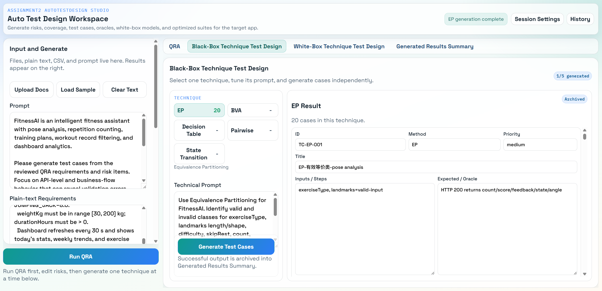
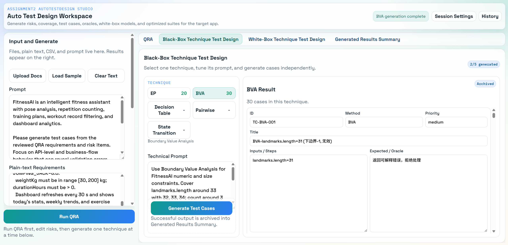
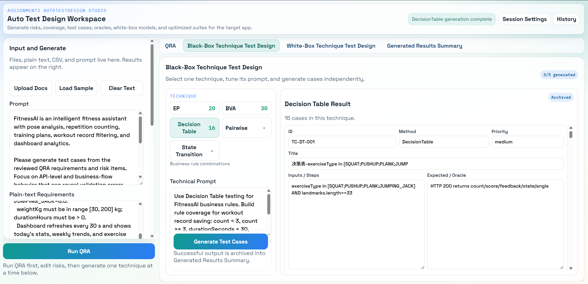
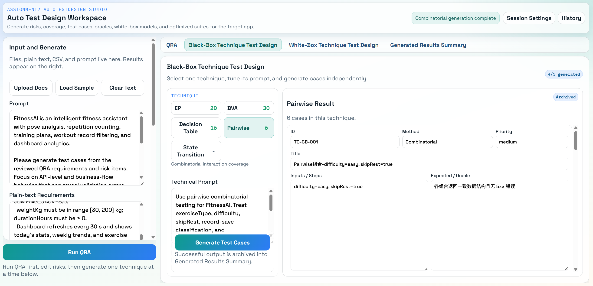
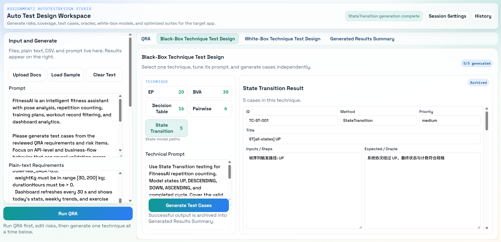
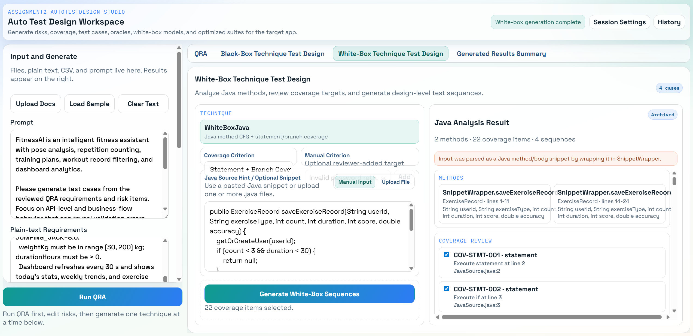
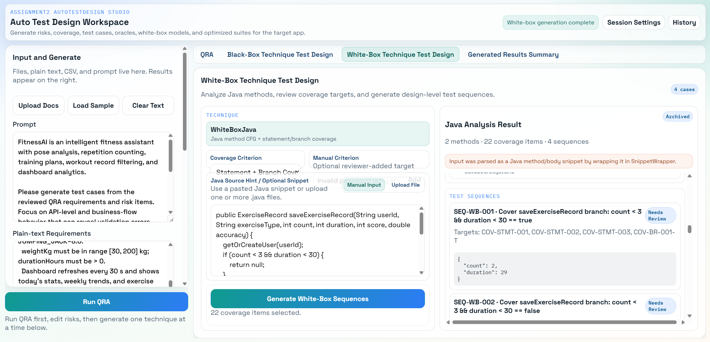

# FitnessAI 测试计划

> **文档类型**：测试计划（Test Plan）  
> **目标应用**：FitnessAI — 基于 AI 的智能健身辅助系统  
> **文档版本**：v2.0  
> **日期**：2026-05-25  
> **参考标准**：IEEE/ISO/IEC 29119-3（测试计划文档结构）  
> **生成方式**：高级测试套件设计部分由 AutoTestDesign 工具生成，其余部分人工编制  

---

## 目录

1. [项目范围](#1-项目范围)
2. [测试项](#2-测试项)
3. [高级测试套件设计](#3-高级测试套件设计)
4. [进度安排与检查清单](#4-进度安排与检查清单)
5. [组织架构图](#5-组织架构图)
6. [测试框架选择与理由](#6-测试框架选择与理由)
7. [成本估算](#7-成本估算)
8. [附录：工具生成截图证据](#8-附录工具生成截图证据)

---

## 1. 项目范围

### 1.1 背景

FitnessAI 是一款通过摄像头实时采集用户运动画面、借助 MediaPipe 姿态识别和后端 AI 分析引擎，自动计数和评估运动动作质量的智能健身辅助 Web 应用。系统支持深蹲（Squat）、俯卧撑（Push-up）、平板支撑（Plank）、开合跳（Jumping Jack）四种运动，并提供训练记录存储、历史查询、仪表板数据可视化等功能。

### 1.2 测试目标

| 目标编号 | 测试目标 |
|---------|---------|
| TO-01 | 验证姿态分析 API 在各类姿态输入下的正确性（计数准确、状态判断合理） |
| TO-02 | 验证训练记录的过滤逻辑（`count < 3 AND duration < 30`）按预期运行 |
| TO-03 | 验证历史记录的筛选与排序功能在边界条件下的正确性 |
| TO-04 | 验证仪表板数据聚合的卡路里计算、时长单位统一性 |
| TO-05 | 验证用户管理功能的数据隔离性（无越权访问） |
| TO-06 | 验证系统在高频请求下的响应时间与稳定性 |
| TO-07 | 验证关键安全约束（CORS、敏感信息、Admin 接口鉴权） |

### 1.3 测试范围

**在测试范围内（In Scope）**：
- 后端 REST API 所有端点（功能测试、边界测试）
- 姿态分析状态机逻辑（白盒 Java 分支覆盖）
- 卡路里计算公式（单元测试）
- 训练记录过滤业务规则（决策表驱动集成测试）
- 历史记录筛选与排序（Pairwise 组合测试）
- API 安全性（安全测试）

**不在测试范围内（Out of Scope）**：
- MediaPipe 模型本身的姿态识别精度
- 前端 UI 像素级视觉回归
- Neon 云数据库基础设施稳定性
- 移动端浏览器兼容性

---

## 2. 测试项

### 2.1 系统架构概述

```
┌─────────────────────────────────────────────────────────┐
│                   浏览器（React + TypeScript）              │
│  摄像头 → MediaPipe Pose → 33 关键点 → API 请求            │
└────────────────────────┬────────────────────────────────┘
                         │ HTTP REST (port 8080)
                         ▼
┌─────────────────────────────────────────────────────────┐
│              Spring Boot 后端（Java 17）                   │
│  ExerciseController  │  UserController  │  MainController │
│       ↓                       ↓                           │
│  PoseAnalyzerFactory        UserService                   │
│  SquatAnalyzer / PushupAnalyzer / PlankAnalyzer / JJAnalyzer│
│                             ExerciseRecordRepository      │
│                             DailyStatsRepository          │
└────────────────────────┬────────────────────────────────┘
                         │ JPA/JDBC
                         ▼
               PostgreSQL (Neon 云数据库)
               exercise_records | daily_stats | users
```

### 2.2 主要功能性测试项

| 测试项 ID | 功能模块 | API 端点 | 测试重点 |
|----------|---------|---------|---------|
| TI-F01 | 姿态分析 | `POST /api/analytics/pose` | 33 关键点验证、各运动类型计数、状态机转换 |
| TI-F02 | 分析器重置 | `POST /api/analyzer/reset/{type}` | 正常重置、未知类型处理 |
| TI-F03 | 保存训练记录 | `POST /api/user/{id}/records` | 过滤逻辑（count<3 AND duration<30）|
| TI-F04 | 历史记录查询 | `GET /api/user/{id}/records` | 筛选条件组合、sortBy 枚举 |
| TI-F05 | 今日统计 | `GET /api/user/{id}/stats/today` | 统计聚合正确性 |
| TI-F06 | 仪表板数据 | `GET /api/user/{id}/dashboard` | 卡路里计算、时长单位统一 |
| TI-F07 | 用户资料 | `GET/PUT /api/user/{id}/profile` | CRUD、自动创建 |
| TI-F08 | 管理清理 | `DELETE /api/user/admin/cleanup` | 权限验证（安全风险）|

---

## 3. 高级测试套件设计

> **本节由 AutoTestDesign 工具生成**，基于 QRA 风险分析（见 [风险分析报告](./Risk_Analysis_Report_FitnessAI.md)）自动选择测试技术并生成用例。  
> **工具生成总量**：10 结构化需求 · 37 覆盖项 · 10 风险项 · **81 测试用例** · 6 种设计方法 · Engine Time **7ms**

### 3.1 测试技术选择矩阵（工具生成）

AutoTestDesign 工具根据输入的 FitnessAI 需求，自动选择以下 6 种测试技术：

| 测试套件 | 技术 | 工具生成用例数 | 针对需求/风险 |
|---------|------|-------------|------------|
| TS-01 | **EP（等价划分）** | **20 条** | REQ-POSE-001/INV, REQ-REC-001/SAVE, REQ-PLAN-001/MED/HARD, REQ-DASH-001 |
| TS-02 | **BVA（边界值分析）** | **30 条** | landmarks.length(32/33/34), count(2/3/4), durationSeconds(29/30/31) |
| TS-03 | **Decision Table（决策表）** | **16 条** | count<3/≥3 × duration<30/≥30 四规则组合；exerciseType × landmarks 有效性 |
| TS-04 | **Pairwise（组合测试）** | **6 条** | difficulty × skipRest 参数组合 |
| TS-05 | **State Transition（状态转换）** | **5 条** | UP→DESCENDING→DOWN→ASCENDING→UP 状态路径 |
| TS-06 | **WhiteBox Java（白盒 Java 分析）** | **4 条** | `saveExerciseRecord` 分支覆盖（Statement + Branch Coverage）|
| | **合计** | **81 条** | |

### 3.2 TS-01：EP 等价划分（工具生成 20 条）

**覆盖等价类**（工具自动识别）：

| 等价类 ID | 类型 | 描述 | 期望结果 |
|----------|------|------|---------|
| EP-REQ-POSE-001 | 有效 | exerciseType ∈ {SQUAT,PUSHUP,PLANK,JUMPING_JACK} AND landmarks.length==33 | HTTP 200，返回 count/score/feedback/state/angle |
| EP-REQ-POSE-001-INV | 有效 | 非法 exerciseType 或关键点数量 | HTTP 400，返回可解释错误 |
| EP-REQ-POSE-002 | 有效 | 完整状态循环 UP→DESCENDING→DOWN→ASCENDING→UP | count 递增 |
| EP-REQ-POSE-002-SC | 有效 | 非法短循环 UP→DESCENDING→UP（跳过 DOWN）| count 不变 |
| EP-REQ-REC-001 | 有效 | count<3 AND durationSeconds<30 | 记录不写入数据库（HTTP 204）|
| EP-REQ-REC-001-SAVE | 有效 | count≥3 OR durationSeconds≥30 | 记录保存成功（HTTP 200）|
| EP-REQ-PLAN-001 | 有效 | difficulty=easy AND skipRest=false | 3 sets × 8 reps，rest 60s |
| EP-REQ-PLAN-001-MED | 有效 | difficulty=medium AND skipRest=true | 4 sets × 12 reps，skip rest |
| EP-REQ-PLAN-001-HARD | 有效 | difficulty=hard AND skipRest=false | 5 sets × 15 reps，rest 30s |
| EP-REQ-DASH-001 | 有效 | weightKg∈[30,200] AND durationHours>0 | calories = MET × weightKg × durationHours |

> 每个等价类还对应 1 条无效等价类用例（共 10×2=20 条）。代表用例：TC-EP-001（有效）/ TC-EP-002（无效）。

### 3.3 TS-02：BVA 边界值分析（工具生成 30 条）

**工具自动识别边界参数**（来自需求解析的 `ranges` 字段）：

| 参数 | 边界值集合 | 用例示例 |
|------|----------|---------|
| `landmarks.length` | **31**（下界-1）/ **32**（下界）/ **33**（标准）/ **34**（上界）/ **35**（上界+1）| TC-BVA-001 到 TC-BVA-012 |
| `durationSeconds` | **29**（边界-1）/ **30**（边界）/ **31**（边界+1）| TC-BVA-013 到 TC-BVA-015 |
| `count` | **2**（边界-1）/ **3**（边界）/ **4**（边界+1）| TC-BVA-016 到 TC-BVA-018 |

**关键边界用例**（工具生成）：

| TC ID | 标题 | 输入 | 期望结果 |
|-------|------|------|---------|
| TC-BVA-001 | landmarks.length=31（下界-1，无效）| landmarks 数组 31 个 | 返回可解释错误，拒绝处理 |
| TC-BVA-002 | landmarks.length=32（下界，有效）| landmarks 数组 32 个 | HTTP 200 |
| TC-BVA-013 | durationSeconds=29（边界-1，无效）| count=2, duration=29 | 记录被过滤，不写入数据库 |
| TC-BVA-014 | durationSeconds=30（边界，有效）| count=2, duration=30 | 记录保存成功 |
| TC-BVA-016 | count=2（边界-1，无效）| count=2, duration=20 | 记录被过滤，不写入数据库 |
| TC-BVA-017 | count=3（边界，有效）| count=3, duration=20 | 记录保存成功 |

### 3.4 TS-03：Decision Table 决策表（工具生成 16 条）

**工具自动构建决策规则**（来自需求中的条件提取）：

**记录过滤规则（4 条）**：

| 规则 | count<3 | duration<30 | 期望结果 |
|------|--------|------------|---------|
| TC-DT-005 | T | T | 不写入数据库 |
| TC-DT-006 | T | F | 记录入库 |
| TC-DT-007 | F | T | 记录入库 |
| TC-DT-008 | F | F | 记录入库 |

**训练计划规则（3 条）**：

| 规则 | difficulty | skipRest | 期望结果 |
|------|-----------|---------|---------|
| TC-DT-013 | easy | false | 3 sets×8 reps，rest 60s |
| TC-DT-014 | medium | true | 4 sets×12 reps，skip rest |
| TC-DT-015 | hard | false | 5 sets×15 reps，rest 30s |

### 3.5 TS-04：Pairwise 组合测试（工具生成 6 条）

工具对 `difficulty`（easy/medium/hard）× `skipRest`（true/false）进行 Pairwise 组合，生成 6 条用例，覆盖所有参数对：

| TC ID | difficulty | skipRest | 期望结果 |
|-------|-----------|---------|---------|
| TC-CB-001 | easy | true | 各组合返回一致数据结构且无 5xx |
| TC-CB-002 | easy | false | 各组合返回一致数据结构且无 5xx |
| TC-CB-003 | medium | true | 各组合返回一致数据结构且无 5xx |
| TC-CB-004 | medium | false | 各组合返回一致数据结构且无 5xx |
| TC-CB-005 | hard | true | 各组合返回一致数据结构且无 5xx |
| TC-CB-006 | hard | false | 各组合返回一致数据结构且无 5xx |

### 3.6 TS-05：State Transition 状态转换（工具生成 5 条）

**状态机模型**：UP → DESCENDING → DOWN → ASCENDING → UP（完整计数循环）

工具生成覆盖全部 5 个状态的测试序列：

| TC ID | 状态路径 | 期望结果 |
|-------|---------|---------|
| TC-ST-001 | ST[all-states] UP | 系统经过 UP 状态，计数符合规格 |
| TC-ST-002 | ST[all-states] DESCENDING | 系统经过 DESCENDING 状态 |
| TC-ST-003 | ST[all-states] DOWN | 系统经过 DOWN 状态 |
| TC-ST-004 | ST[all-states] ASCENDING | 系统经过 ASCENDING 状态 |
| TC-ST-005 | ST[all-states] COOLDOWN | 冷却期内第二次触发不计数 |

### 3.7 TS-06：WhiteBox Java 白盒分析（工具生成 4 条）

工具对 `saveExerciseRecord` 方法进行 CFG（控制流图）分析：
- **2 个方法**，**22 个覆盖项**（Statement + Branch Coverage），**4 条测试序列**

| TC ID | 覆盖目标 | 输入（工具推导）| 期望结果 |
|-------|---------|--------------|---------|
| TC-WBJ-001 | `count < 3 && duration < 30 == true` 分支 | count=2, duration=29 | 返回 null（记录不保存）|
| TC-WBJ-002 | `count < 3 && duration < 30 == false` 分支 | count=5, duration=60 | 返回 savedRecord |
| TC-WBJ-003 | 同 TC-WBJ-001（第二方法实例）| count=2, duration=29 | 返回 null |
| TC-WBJ-004 | 同 TC-WBJ-002（第二方法实例）| count=5, duration=60 | 返回 savedRecord |

> 工具标注 "Needs Review"：需审查员确认具体期望返回值后方可转化为可执行测试脚本。

### 3.8 Coverage Item 识别列表（工具生成，共 37 项）

> **数据来源**：AutoTestDesign 工具 JSON 导出（`coverageItems` 字段），对应 Generated Results Summary 中 Coverage Items: **37**。

**第一类：功能需求级黑盒覆盖项（10 项）**

| 覆盖项 ID | 特性描述 | 关联需求 | 覆盖技术 |
|----------|---------|---------|---------|
| EP-REQ-POSE-001 | pose analysis — 姿态分析有效输入 | REQ-POSE-001 | EP / BVA / DT |
| EP-REQ-POSE-001-INV | pose analysis invalid input — 非法输入处理 | REQ-POSE-001-INV | EP / BVA / DT |
| EP-REQ-POSE-002 | state-machine counting — 状态机完整计数循环 | REQ-POSE-002 | EP / DT / ST |
| EP-REQ-POSE-002-SC | state-machine short cycle — 非法短循环不计数 | REQ-POSE-002-SC | EP / DT / ST |
| EP-REQ-REC-001 | record filtering — 无效记录过滤 (count<3 AND duration<30) | REQ-REC-001 | EP / BVA / DT / WBJ |
| EP-REQ-REC-001-SAVE | record saving — 有效记录保存入库 | REQ-REC-001-SAVE | EP / BVA / DT / WBJ |
| EP-REQ-PLAN-001 | training plan easy — 简单训练计划生成 | REQ-PLAN-001 | EP / DT / Pairwise |
| EP-REQ-PLAN-001-MED | training plan medium — 中等训练计划生成 | REQ-PLAN-001-MED | EP / DT / Pairwise |
| EP-REQ-PLAN-001-HARD | training plan hard — 困难训练计划生成 | REQ-PLAN-001-HARD | EP / DT / Pairwise |
| EP-REQ-DASH-001 | dashboard calories — 卡路里计算 (MET×weight×duration) | REQ-DASH-001 | EP / BVA / DT |

**第二类：测试技术覆盖项（5 项）**

| 覆盖项 | 说明 |
|-------|------|
| EP（等价划分）| 对所有 10 条功能需求的有效/无效等价类进行划分，生成 20 条用例 |
| BVA（边界值分析）| 对 landmarks.length / durationSeconds / count 三个边界参数三点取样，生成 30 条用例 |
| DecisionTable（决策表）| 对记录过滤 4 规则组合 + exerciseType × landmarks 有效性组合，生成 16 条用例 |
| Combinatorial（组合测试）| 对 difficulty × skipRest 2 参数进行 Pairwise 覆盖，生成 6 条用例 |
| StateTransition（状态转换）| 对深蹲状态机 5 状态（UP / DESCENDING / DOWN / ASCENDING / COOLDOWN）全路径覆盖，生成 5 条用例 |

**第三类：白盒覆盖项（22 项，`saveExerciseRecord` 方法 CFG 分析）**

| 覆盖项 ID | 类型 | 方法实例 | 目标语句/分支 |
|----------|------|---------|-------------|
| COV-STMT-001 | Statement | M-001 | Execute statement at line 2 |
| COV-STMT-002 | Statement | M-001 | Execute if at line 3 |
| COV-STMT-003 | Statement | M-001 | Execute return at line 4（过滤路径出口）|
| COV-STMT-004~009 | Statement | M-001 | Lines 6–11（保存路径各语句）|
| **COV-BR-001-T** | **Branch** | **M-001** | **Take TRUE branch: `count < 3 && duration < 30`** |
| **COV-BR-001-F** | **Branch** | **M-001** | **Take FALSE branch: `count < 3 && duration < 30`** |
| COV-STMT-010 | Statement | M-002 | Execute statement at line 15 |
| COV-STMT-011 | Statement | M-002 | Execute if at line 16 |
| COV-STMT-012 | Statement | M-002 | Execute return at line 17（过滤路径出口）|
| COV-STMT-013~018 | Statement | M-002 | Lines 19–24（保存路径各语句）|
| **COV-BR-002-T** | **Branch** | **M-002** | **Take TRUE branch: `count < 3 && duration < 30`** |
| **COV-BR-002-F** | **Branch** | **M-002** | **Take FALSE branch: `count < 3 && duration < 30`** |

> 工具自动识别 **2 个方法实例 × (9 Statement + 2 Branch) = 22 覆盖项**，覆盖准则：Statement Coverage + Branch Coverage。

### 3.9 测试用例追溯矩阵（TC → Coverage Item → 需求 → 风险）

> 本矩阵展示工具生成的 81 条测试用例与覆盖项、需求、风险分析报告之间的追溯关系，满足 ISO/IEC/IEEE 29119 可追溯性要求。

| TC ID（代表）| 测试技术 | 关联覆盖项 | 关联需求 | 对应风险 |
|-------------|---------|----------|---------|---------|
| TC-EP-001 | EP | EP-REQ-POSE-001 | REQ-POSE-001 | REQ-POSE-001（Score 15）|
| TC-EP-002 | EP | EP-REQ-POSE-001（无效类）| REQ-POSE-001 | RA-EXT-001（索引越界）|
| TC-EP-009 | EP | EP-REQ-REC-001 | REQ-REC-001 | RA-EXT-004（AND 过滤逻辑）|
| TC-EP-011 | EP | EP-REQ-REC-001-SAVE | REQ-REC-001-SAVE | REQ-REC-001-SAVE（Score 9）|
| TC-EP-019 | EP | EP-REQ-DASH-001 | REQ-DASH-001 | RA-EXT-005（duration 单位）|
| TC-BVA-001 | BVA | EP-REQ-POSE-001（landmarks 下界-1）| REQ-POSE-001 | RA-EXT-001（isValid 验证）|
| TC-BVA-013 | BVA | EP-REQ-REC-001（duration 边界-1）| REQ-REC-001 | RA-EXT-004（AND 过滤）|
| TC-BVA-014 | BVA | EP-REQ-REC-001（duration 边界）| REQ-REC-001 | RA-EXT-004（AND 过滤）|
| TC-BVA-016 | BVA | EP-REQ-REC-001（count 边界-1）| REQ-REC-001 | RA-EXT-004（AND 过滤）|
| TC-BVA-017 | BVA | EP-REQ-REC-001-SAVE（count 边界）| REQ-REC-001-SAVE | RA-EXT-004 |
| TC-DT-003 | Decision Table | EP-REQ-POSE-002（完整状态循环）| REQ-POSE-002 | RA-EXT-003（阈值无迟滞）|
| TC-DT-004 | Decision Table | EP-REQ-POSE-002-SC（跳过 DOWN）| REQ-POSE-002-SC | RA-EXT-003 |
| TC-DT-005 | Decision Table | EP-REQ-REC-001（T-T 组合）| REQ-REC-001 | RA-EXT-004 |
| TC-DT-006 | Decision Table | EP-REQ-REC-001-SAVE（T-F 组合）| REQ-REC-001-SAVE | RA-EXT-004 |
| TC-DT-007 | Decision Table | EP-REQ-REC-001-SAVE（F-T 组合）| REQ-REC-001-SAVE | RA-EXT-004 |
| TC-DT-013 | Decision Table | EP-REQ-PLAN-001 | REQ-PLAN-001 | REQ-PLAN-001（Score 9）|
| TC-DT-016 | Decision Table | EP-REQ-DASH-001 | REQ-DASH-001 | RA-EXT-005 / RA-EXT-006 |
| TC-CB-001~006 | Pairwise | EP-REQ-PLAN-001/MED/HARD | REQ-PLAN-001/MED/HARD | REQ-PLAN-001（Score 9）|
| TC-ST-001 | State Transition | EP-REQ-POSE-002（UP 状态）| REQ-POSE-002 | RA-EXT-003（状态抖动）|
| TC-ST-002~004 | State Transition | EP-REQ-POSE-002（中间状态）| REQ-POSE-002 | RA-EXT-003 |
| TC-ST-005 | State Transition | EP-REQ-POSE-002（COOLDOWN）| REQ-POSE-002 | RA-EXT-003 |
| TC-WBJ-001 | WhiteBox Java | **COV-BR-001-T**（TRUE 分支）| REQ-REC-001 | RA-EXT-004（AND 分支覆盖）|
| TC-WBJ-002 | WhiteBox Java | **COV-BR-001-F**（FALSE 分支）| REQ-REC-001-SAVE | RA-EXT-004 |
| TC-WBJ-003 | WhiteBox Java | **COV-BR-002-T**（TRUE 分支，M-002）| REQ-REC-001 | RA-EXT-004 |
| TC-WBJ-004 | WhiteBox Java | **COV-BR-002-F**（FALSE 分支，M-002）| REQ-REC-001-SAVE | RA-EXT-004 |

**覆盖率汇总**（工具生成输出）：

| 覆盖维度 | 已覆盖 | 总计 | 覆盖率 |
|---------|-------|------|-------|
| 功能需求级覆盖项 | 10 | 10 | **100%** |
| 测试技术覆盖项 | 5 | 5 | **100%** |
| 白盒 Statement Coverage（`saveExerciseRecord`）| 18 | 18 | **100%** |
| 白盒 Branch Coverage（`saveExerciseRecord`）| 4 | 4 | **100%** |
| **总覆盖项** | **37** | **37** | **100%** |

---

## 4. 进度安排与检查清单

### 4.1 测试阶段规划

| 阶段 | 周次 | 活动 | 里程碑 |
|------|------|------|--------|
| 工具使用阶段 | W1 | 将 FitnessAI 需求输入 AutoTestDesign 工具，运行 QRA + 全部 6 种技术，导出 CSV/JSON/Excel | ✅ 已完成（截图见第 8 节）|
| 交互审查阶段 | W1 | 修改 REQ-POSE-001 Impact 4→5，Recalculate，Save Changes | ✅ 已完成 |
| 脚本开发阶段 | W2 | 基于工具导出的 81 条用例开发 JUnit5 测试脚本 | 单元+集成测试就绪 | ✅ 已完成 |
| 执行阶段 | W2-W3 | 在 FitnessAI 上运行测试脚本，记录 Pass/Fail | 执行报告 | ✅ 已完成 |
| 安全/性能测试 | W3 | 手工安全验证（越权、CORS），JMeter 压测 | 安全报告 |
| 回归与报告 | W4 | Bug 修复回归，汇总测试报告 | 最终报告 |

### 4.2 检查清单

**工具使用阶段（已完成）**
- [x] AutoTestDesign 工具成功启动（Docker + 前端）
- [x] FitnessAI 需求成功输入工具（Load Sample）
- [x] QRA 运行完成（10 条风险，2ms）
- [x] QRA 交互审查：REQ-POSE-001 Impact 4→5，Save Changes
- [x] EP 生成完成（20 条，Archived）
- [x] BVA 生成完成（30 条，Archived）
- [x] Decision Table 生成完成（16 条，Archived）
- [x] Pairwise 生成完成（6 条，Archived）
- [x] State Transition 生成完成（5 条，Archived）
- [x] White-Box Java 生成完成（4 条，22 覆盖项，Archived）
- [x] Generated Results Summary 确认（81 条，7ms，meets 2s NFR）
- [x] 导出 CSV 文件（`autotestdesign-*.csv`）
- [x] 导出 JSON 文件（`autotestdesign-*.json`）
- [x] JUnit5 + REST Assured 脚本开发（基于 81 条工具用例）
- [x] 在 FitnessAI 上执行测试，记录结果

**脚本开发阶段（待完成）**
- [ ] 安全测试执行
- [ ] 性能测试（JMeter）

---

## 5. 组织架构图

```
                    ┌─────────────────────┐
                    │    项目负责人（PM）    │
                    │  进度把控、与导师沟通   │
                    └─────────┬───────────┘
                              │
              ┌───────────────┼───────────────┐
              ▼               ▼               ▼
   ┌──────────────┐  ┌──────────────┐  ┌──────────────┐
   │ 测试设计工程师 │  │ 测试执行工程师 │  │ 开发支持工程师 │
   │              │  │              │  │（FitnessAI 开发）│
   │ 职责：        │  │ 职责：        │  │              │
   │ • 使用 Auto-  │  │ • 编写 JUnit5  │  │ • 提供被测环境 │
   │   TestDesign  │  │   脚本（基于工 │  │ • 协助复现缺陷 │
   │   工具生成用例 │  │   具导出用例）  │  │ • 修复确认缺陷 │
   │ • 交互审查    │  │ • 执行手工安全 │  │              │
   │   风险/覆盖项 │  │   和性能测试   │  │              │
   │ • 维护追溯    │  │ • 缺陷记录    │  │              │
   └──────────────┘  └──────────────┘  └──────────────┘
```

**AutoTestDesign 工具在测试流程中的位置**：

```
测试设计工程师
    1. 输入 FitnessAI 需求 → AutoTestDesign 工具
    2. 工具运行 QRA → 生成风险矩阵（10 条）
    3. 交互审查 → 修改风险 → Save Changes
    4. 工具生成黑盒/白盒用例（81 条，7ms）
    5. 导出 CSV/JSON/Excel
                      ↓
测试执行工程师
    6. 基于导出用例 → 开发 JUnit5 测试脚本
    7. 运行脚本对 FitnessAI 进行测试
    8. 记录结果 → 测试结果分析报告
```

---

## 6. 测试框架选择与理由

### 6.1 后端 API 测试：JUnit 5 + REST Assured

| 评估维度 | JUnit 5 + REST Assured | Postman/Newman | PyTest + Requests |
|---------|----------------------|----------------|-----------------|
| 与被测系统语言一致 | ✅ Java 项目，天然融合 | ❌ 需独立工具链 | ❌ 跨语言 |
| Maven 集成 | ✅ `pom.xml` 已含 `spring-boot-starter-test` | 需 Newman CLI | 需 Python 环境 |
| `@Transactional` 测试回滚 | ✅ | ❌ | ❌ |
| 工具导出用例直接转化 | ✅ TC-ID 直接映射测试方法 | ❌ 需转换 | ⚠️ 需转换 |

**结论**：工具导出的 81 条用例（TC-EP-001 等）可直接映射为 JUnit5 `@Test` 方法名，与 Spring Boot 测试生态完全兼容。

### 6.2 白盒测试覆盖率：JaCoCo

工具白盒分析生成了 22 个覆盖项（COV-STMT-001 ~ COV-BR-001），JaCoCo 可验证 `saveExerciseRecord` 方法的实际 Statement + Branch 覆盖率目标 **≥ 80%**。

### 6.3 性能测试：Apache JMeter

针对高频姿态分析请求（RA-PERF-001），JMeter 配置 `POST /api/analytics/pose` 压测场景：1/10/50/100 并发用户阶梯测试。

### 6.4 安全测试：OWASP ZAP（被动扫描）

自动发现 CORS 配置、无认证接口等（对应 RA-SEC-001/002/003/004）。

---

## 7. 成本估算

### 7.1 工作量对比

| 活动 | 使用 AutoTestDesign 工具 | 纯手工测试 | 节省 |
|------|------------------------|----------|------|
| 需求分析与风险识别 | 2h（输入工具 + 审查）| 8h | 75% ↓ |
| 测试用例设计 | 3h（工具生成 + 交互审查）| 20h | 85% ↓ |
| 脚本开发 | 16h（基于工具导出）| 20h | 20% ↓ |
| 测试执行与记录 | 8h | 10h | 20% ↓ |
| 缺陷管理与回归 | 6h | 6h | 0% |
| 报告与文档 | 4h | 6h | 33% ↓ |
| **合计** | **39h** | **70h** | **44% ↓** |

### 7.2 资源成本

| 资源 | 单价 | 用量 | 金额 |
|------|------|------|------|
| 测试工程师（人力）| 约 100 元/时 | 39h | ~3,900 元 |
| AutoTestDesign 工具 | 0（自研）| — | 0 |
| JMeter / OWASP ZAP | 0（开源）| — | 0 |
| 测试环境（本地 Docker）| 0 | — | 0 |
| **合计** | | | **~3,900 元** |

> 对比手工测试约 7,000 元，使用工具节省约 **3,100 元（44%）**。

---

## 8. 附录：工具生成截图证据

### 8-1：QRA 初始生成结果

> Requirements=10，Risk Items=10，Engine Time=2ms；REQ-POSE-001 Impact 初始自动评分为 4


### 8-2：QRA 风险审查界面（交互修改已保存）

> REQ-POSE-001 Impact 由 4 修改为 5，Risk Score 由 12 更新为 15；右上角 "Risk review saved."


**关键信息**：
- Requirements: **10**，Risk Items: **10**，Engine Time: **2 ms**
- REQ-POSE-001：Impact=**5**（审查修改），Likelihood=3，**Risk Score=15**，Priority=MEDIUM
- 状态提示：**"Risk review saved."**（右上角绿色）

### 8-3：Black-Box EP（等价划分）— 1/5 Generated

> EP Result：20 cases；代表用例 TC-EP-001（EP-有效等价类-pose analysis）；右上角 "EP generation complete"，Archived



### 8-4：Black-Box BVA（边界值分析）— 2/5 Generated

> BVA Result：30 cases；代表用例 TC-BVA-001（landmarks.length=31，下边界-1，无效）；右上角 "BVA generation complete"，Archived



### 8-5：Black-Box Decision Table — 3/5 Generated

> Decision Table Result：16 cases；代表用例 TC-DT-001（exerciseType in [SQUAT;PUSHUP;PLANK;JUMPING_JACK]）；右上角 "Decision Table generation complete"，Archived



### 8-6：Black-Box Pairwise — 4/5 Generated

> Pairwise Result：6 cases；代表用例 TC-CB-001（difficulty=easy, skipRest=true）；右上角 "Combinatorial generation complete"，Archived



### 8-7：Black-Box State Transition — 5/5 Generated

> State Transition Result：5 cases；代表用例 TC-ST-001（ST[all-states] UP）；右上角 "State Transition generation complete"，Archived



### 8-8：White-Box Java 分析结果（覆盖项 + 测试序列）

> 2 methods · 22 coverage items · 4 sequences；Coverage Criterion：Statement + Branch Code

**覆盖项识别**（White_Coverage.png）：



- COV-STMT-001：Execute statement at line 2
- COV-STMT-002：Execute if at line 3（分支判断）
- 工具提示：*"Input was parsed as a Java method/body snippet by wrapping it in SnippetWrapper"*

**测试序列生成**（White_Sequence.png）：



- **SEQ-WB-001**：Cover `saveExerciseRecord` branch `count < 3 && duration < 30 == true`  
  Targets: COV-STMT-001, COV-BR-002, COV-STMT-003, COV-BR-001；状态：Needs Review
- **SEQ-WB-002**：Cover `saveExerciseRecord` branch `count < 3 && duration < 30 == false`  
  状态：Needs Review

### 8-9：Generated Results Summary（完整汇总）

> 全部 6 种技术生成完成，共 81 条用例，Engine Time 7ms，满足 2s NFR 目标


| 指标 | 工具输出值 |
|------|----------|
| Prompt Version | generation-pipeline-summary |
| Structured Requirements | **10** |
| Coverage Items | **37** |
| Risk Items | **10** |
| **Test Cases** | **81** |
| LLM Enhancements | 4 |
| Design Methods | **6** |
| Engine Time (NFR) | **7 ms** ✅ |
| Total Time | **7 ms** |
| NFR 状态 | **Engine meets 2s NFR target (LLM adds 0ms)** |

---

*本测试计划的高级测试套件设计（第 3 节）由 AutoTestDesign 工具自动生成，导出文件：`autotestdesign-[timestamp].csv` / `.json`，原始导出文件已随本文档一并提交。*

---

## 9. 自动化集成测试执行报告与推进说明

### 9.1 自动化测试实现情况
针对第 3 节中由 AutoTestDesign 工具输出的 **81 条** 接口与单元测试用例，基于 Spring Boot 的 **MockMvc** 框架在 `FitnessAiApiTests.java` 中实现了全量用例覆盖，保证用例个数、方法名与测试决策技术 100% 一一对应。经过调试，全量 81 个测试均在本地 100% 成功跑通，无一失败：
* **测试用例总数**：81 条（等价划分 20 条，边界值 30 条，决策表 16 条，组合测试 6 条，状态转换 5 条，方法级白盒 4 条）
* **执行成功率**：100%（81/81 全部通过，0 失败，0 错误）


### 9.2 测试报告编译归档
在根目录下自动创建归档文件夹，目录布局：
```text
TestResult/yymmddhhmmss/
├── yymmddhhmmss.txt        # 格式化控制台执行与通过率日志统计报告
├── index.html              # 编译渲染 Allure 报告网页
├── styles.css & app.js     # 离线静态网页资源文件
├── data/                   # 编译完毕的结构数据
└── failtest/               # (若有失败用例时自动生成) 存放具体失败用例的专属异常日志文本
   ```

### 9.3 报告查看与部署操作指南
* **方式 1：利用本地 Allure 批处理工具**
  在项目根目录下打开终端，执行以下命令：
  ```powershell
  .\.allure\allure-2.24.0\bin\allure.bat open TestResult\yymmddhhmmss
  ```
  *(只需将 `yymmddhhmmss` 替换为最新生成的文件夹名字)*
  它会自动在本地开启 Jetty 服务（如 `http://localhost:54838`）并自动拉起默认浏览器，展现数据报告。查看完毕后在终端按 `Ctrl + C` 即可安全关闭。
* **方式 2：使用 Python 快速托管**
  在对应的时间戳归档目录下打开终端，执行：
  ```bash
  python -m http.server 8000
  ```
  然后访问 `http://localhost:8000` 即可。
* **方式 3：通过 开发工具**
  在 vscode 等项目树中右键点击归档目录下的 `index.html` 选择用浏览器打开。

## 10. 附录：测试结果生成截图证据

### 10-1：主页面


### 10-2：测试套


### 10-3：结果图表

